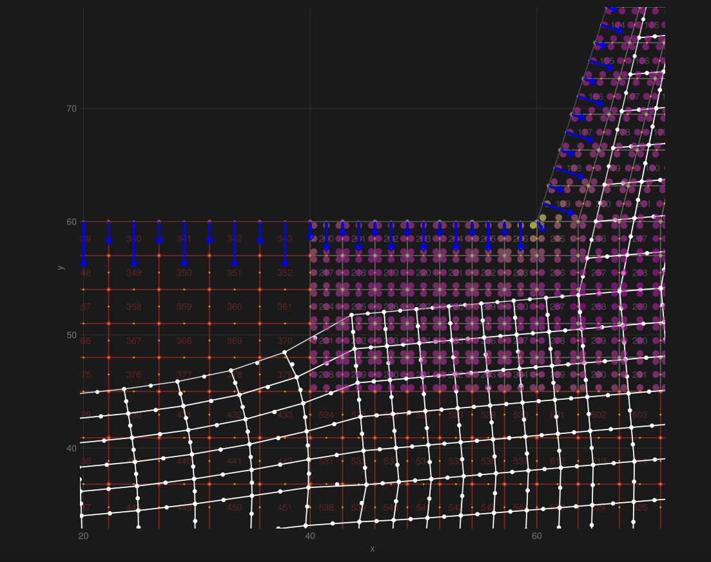

# Solid.jl

*Solid.jl* is an open-source Julia library that brings together Computer-Aided Design (CAD) and the Finite Element Method (FEM).
It provides a clean, high-performance interface for building, solving, and post-processing 1-D/2-D structural and thermal problems, with a roadmap targeting 3-D mechanics, fluid flow, and advanced topology optimization.

---

## Overview

Finite-element analysis follows three high-level stages:

1. **Pre-processing** - define geometry, choose element types, and generate a mesh.
2. **Analysis** - formulate element matrices, assemble a global system of equations, and solve for the unknown fields.
3. **Post-processing** - evaluate derived quantities (stress, temperature, etc.) and visualize results.

Solid.jl implements all three stages in a Julia-native way, supporting sparse matrices for efficient solvers with upcoming experimental GPU support for large-scale problems.

---

## Features

- **Structural mechanics** - gauss quadrature integration for 1-D truss/beam, 2-D plane stress & plane strain
- **Thermal analysis** - gauss quadrature for 1-D heat conduction
- **Topology optimization** - 2-D stress-based pruning
- **High-performance assembly** - static-array element matrices + cheap dense->sparse conversion
- **Solver integration** - direct sparse solvers (todo, gpu acceleration)
- **Extensible architecture** - add new element types (3-D, fluid flow) with minimal boilerplate

---

## Performance tips

| Step | Dense | Sparse |
|------|-----------------------------------|--------------------------|
| Element matrix construction | ~10 ms | ~200 ms |
| Dense -> sparse conversion   | - | ~10 ms |
| Direct solve (LU)           | ~750 ms | ~10 ms |
| GPU-accelerated integration + sparse solving (experimental) | - | TBD |

---

## Roadmap

✅ Completed
- [x] 1-D structural
- [x] 2-D structural
- [x] 1-D heat
- [x] 2-D heat
- [x] 2-D topology optimization (prune low-stress)

🚧 In progress / Planned
- [ ] leverage `StaticArrays.jl` for fast per-element operations
- [ ] Turbo-accelerated element matrix construction
- [ ] GPU accelerated sparse solving
- [ ] 3-D structural
- [ ] 3-D hydraulic flows
- [ ] Non-linear iteration
- [ ] GPU accelerated element matrix construction
- [ ] Adjoint / hyper-complex differentiation for gradients
- [ ] Automatic 2D/3D mesh generation
- [ ] HDG solver for fluid flows
- [ ] Structure-fluid interactions
- [ ] Generative design via evolutionary algorithm / MCTS

---

## Contributing

We welcome contributions of any kind-bug reports, documentation improvements, new element formulations, or performance enhancements.

---

## License

Solid.jl is released under the **AGPLv3 License**. See the `LICENSE` file for the full text.

---

*Enjoy building fast, flexible FEM simulations with Julia!*
