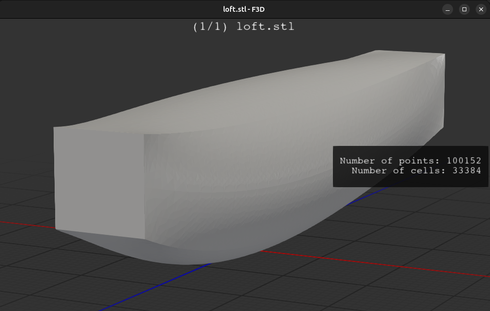

# ccad 

mucad is a small C-ABI-library computer aided design (CAD) package.

It was created to enable me to easily make better CAD files using a parametric constructive solid geometry (CSG) paradigm.

I also hope to use it in FEM and topology optimization.

## Examples




## Usage

You can use ccad by creating primitives and 
```C
#include "mucad.h"
#include <stdio.h>

int main(void) {
	/* Create a unit box from (0,0,0) to (1,1,1) */
	Shape box = mucad_box(0.0, 0.0, 0.0,
			      1.0, 1.0, 1.0);

	/* Write the shape to a STEP file */
	if(mucad_write_step(box, "box.step", -1, 0.1) != 0) {
		fprintf(stderr, "Error: could not write STEP file.\n");
		return 1;
	}
}
```

Compiling (using a test as an example):

```sh
gcc -o box test/test_box.c $(pkg-config --cflags --libs ccad)
./box
```

output:
```
Box written successfully to 'box.stl'.
...
Box written successfully to 'box.step'.
Box written successfully to 'box.obj'.
Box written successfully to 'box.iges'.
```

You can view with `f3d`
```
f3d box.step
```

## Installation
```
make
make check
sudo make install
```

or llvm
```
make CC=clang CXX=clang++ AR=llvm-ar LD=lld
make check CC=clang CXX=clang++ AR=llvm-ar LD=lld
sudo make install
```

## Uninstall

```
sudo make uninstall
```

## Why "ccad"?
ccad enables constructive solid geometry (CSG) modeling, and it is compatible with the C ABI, so I named it ccad.

It is written in C++ and uses Open CASCADE, a C++ library, but "cppcad" just doesn't have the same ring. the name "microcad" was already taken as well.

## TODO
- [ ] static lib of Open CASCADE instructions
